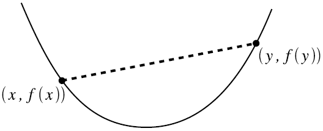
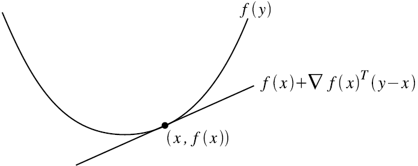

# 凸优化（CS229）

来源：[CS229 Convex Optimization Overview ](http://cs229.stanford.edu/section/cs229-cvxopt.pdf)，[Convex Optimization Overview (cnt’d)](http://cs229.stanford.edu/section/cs229-cvxopt2.pdf)

## 1. introduction

​	很多机器学习问题求解时，都希望**optimize**某个函数的函数值，即，对函数 $f$ ：

$$
f:R^n \rightarrow R
$$

希望能找到 $x \in R^n$ ，使得最小化（最大化） $f(x)$

​	通常情况下，找到函数的全局最优可能非常困难，然而，对于一类特殊的问题，即***convex optimization***，能够**高效地**找到全局最优解（从理论上在多项式时间内解决；在实践上在合理的间范围内能够解决）。

## 2. Convex Sets

### 定义2.1

集合 $C$ 是convex（凸集），当 $\forall x, y \in C$ ， $\theta \in R$ 且 $0 \le \theta \le 1$ ，有

$$
\theta x + (1-\theta)y \in C
$$

**几何描述**为：任取 $C$ 中的两个元素 $x$ 和 $y$ ，用一条线段连接这两个元素，则线段上的每一点均属于集合 $C$ ，点 $\theta x + (1-\theta)y$ 称为 $x$ 和 $y$ 的**convex combination**，如下图所示：

**Examples**：

- $R^n$ .满足 $\forall x, y \in R^n, \theta x +(1-\theta)y \in R^n$
- **Norm ball**：记 $||\bullet||$ 为 $R^n$ 的范数，则集合 $\{x:||x|| \le 1\}$ 为凸集合
  - proof： $x,y \in R^n, ||x|| \le 1, ||y|| \le 1,0 \le \theta \le 1$ ，则 $||\theta x + (1-\theta)y|| \le ||\theta x|| + ||(1-\theta)y||=\theta||x||+(1-\theta)||y||\le 1$ 
- **Affine subspace(仿射子空间)**：矩阵 $A\in R^{m*n}$ ，向量 $b \in R^m$ ，仿射子空间为集合 $\{x\in R^n:Ax=b\}$ 。
  - proof： $Ax=Ay=b$ ，则 $A(\theta x + (1-\theta) y)=A\theta x+Ay-A\theta y=\theta(Ax-Ay)+Ay=b$
- **Polyhedra**：集合 $\{x\in R^n:Ax\preceq b\}$ （ $\preceq$ 为分量不等式componentwise inequality，即 $Ax$ 中的每一个元素均小于等于 $b$ 中相应的元素）
  - proof： $Ax\preceq b, Ay\preceq b, A(\theta x+(1-\theta)y) = \theta Ax+(1-\theta)Ay\preceq b$
- **凸集的交集∩**： 假设 $C_1, C_2, ..., C_k$ 均为凸集，则它们的交集 $\cap_{i=1}^k{C_i}=\{x:x_i \in C_i, \forall i=1,...,k\}$
  - **凸集的并集∪通常不为凸集**
- **正半定矩阵**：矩阵 $A \in R^{n*n}$ 为对称正半定矩阵当且仅当 $A=A^T$ 且 $\forall x \in R^n, x^TAx\ge0$
  - 有两个对称正半定矩阵 $A$ , $B$ ，则 $\forall x \in R^n， x^T(\theta A+(1-\theta)B)x=\theta x^TAx+(1-\theta)x^TBx\ge0$

## 3. Convex function

### 定义3.1

函数 $f:R^n\rightarrow R$ 为凸函数当其定义域 $D(f)$ 为凸集合，且对任意的 $x,y\in D(f)， \theta \in R,0\le\theta\le1$ ，有：

$$
f(\theta x+(1-\theta)y) \le \theta f(x) + (1-\theta)f(y)
$$

- 函数 $f$ **strictly convex** 当严格满足不等式 $x \neq y$ 时，上述不等式仍然成立
- 函数 $f$ 为 **concave（凹函数）** 当 $-f$ 为凸函数
  - 函数 $f$ 为 **strictly concave（严格凹函数）** 当 $-f$ 为严格凸函数

**几何解释**：在凸函数图像上任取两点，用线段将其相连，函数在线段的下方。

### 凸性一阶条件（First Order Condition for Convexity）

假设 $f:R^n\rightarrow R$ 在定义域上处处可导，则函数为凸函数当且仅当 $D(f)$ 为凸集合且 $\forall x,y \in D(f)$ ，有：

$$
f(y) \ge f(x) + \nabla_xf(x)^T(y-x)
$$

其中， $f(x) + \nabla_xf(x)^T(y-x)$ 称为**点 $x$ 在 $f$ 的first-order approximation**

-  $f$ 严格凸，当 $x \neq y$ 上述不等式成立
- $f$ 为凹函数当 $-f$ 为凸函数

**几何解释**：过任意一点 $x$ 做一条 $f(x)$ 的切线，该切线上的所有点均低于相应的 $f(x)$ 值

