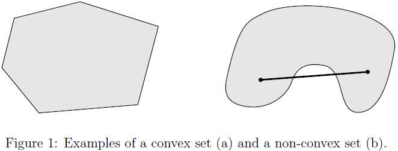

# 凸优化（CS229）

来源：[CS229 Convex Optimization Overview ](http://cs229.stanford.edu/section/cs229-cvxopt.pdf)，[Convex Optimization Overview (cnt’d)](http://cs229.stanford.edu/section/cs229-cvxopt2.pdf)

## 1. introduction

​	很多机器学习问题求解时，都希望**optimize**某个函数的函数值，即，对函数 $f$ ：

$$
f:R^n \rightarrow R
$$

希望能找到 $x \in R^n$ ，使得最小化（最大化） $f(x)$

​	通常情况下，找到函数的全局最优可能非常困难，然而，对于一类特殊的问题，即***convex optimization***，能够**高效地**找到全局最优解（从理论上在多项式时间内解决；在实践上在合理的间范围内能够解决）。

## 2. Convex Sets

### 定义2.1

集合 $C$ 是convex（凸集），当 $\forall x, y \in C$ ， $\theta \in R$ 且 $0 \le \theta \le 1$ ，有

$$
\theta x + (1-\theta)y \in C
$$

**几何描述**为：任取 $C$ 中的两个元素 $x$ 和 $y$ ，用一条线段连接这两个元素，则线段上的每一点均属于集合 $C$ ，点 $\theta x + (1-\theta)y$ 称为 $x$ 和 $y$ 的**convex combination**，如下图所示：

**Examples**：

-  $R^n$ .满足 $\forall x, y \in R^n, \theta x +(1-\theta)y \in R^n$
- 

