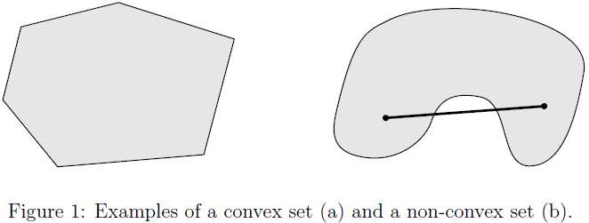
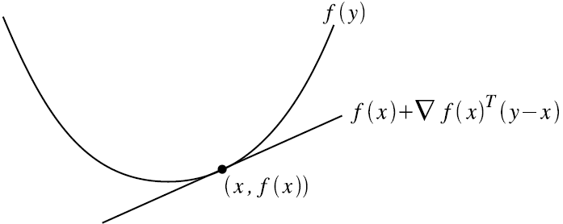
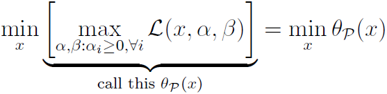
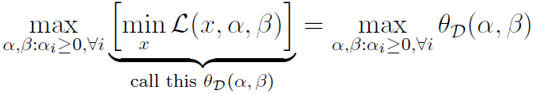
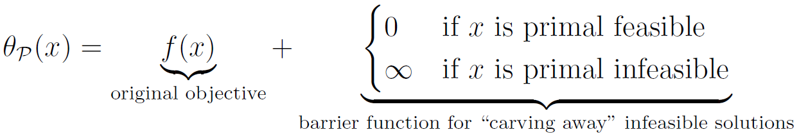

# 凸优化（CS229）

来源：[CS229 Convex Optimization Overview ](http://cs229.stanford.edu/section/cs229-cvxopt.pdf)，[Convex Optimization Overview (cnt’d)](http://cs229.stanford.edu/section/cs229-cvxopt2.pdf)

## 1. introduction

​	很多机器学习问题求解时，都希望**optimize**某个函数的函数值，即，对函数 $f$ ：

$$
f:R^n \rightarrow R
$$

希望能找到 $x \in R^n$ ，使得最小化（最大化） $f(x)$

​	通常情况下，找到函数的全局最优可能非常困难，然而，对于一类特殊的问题，即***convex optimization***，能够**高效地**找到全局最优解（从理论上在多项式时间内解决；在实践上在合理的间范围内能够解决）。

## 2. Convex Sets

### 定义2.1

集合 $C$ 是convex（凸集），当 $\forall x, y \in C$ ， $\theta \in R$ 且 $0 \le \theta \le 1$ ，有

$$
\theta x + (1-\theta)y \in C
$$

**几何描述**为：任取 $C$ 中的两个元素 $x$ 和 $y$ ，用一条线段连接这两个元素，则线段上的每一点均属于集合 $C$ ，点 $\theta x + (1-\theta)y$ 称为 $x$ 和 $y$ 的**convex combination**，如下图所示：

**Examples**：

- $R^n$ .满足 $\forall x, y \in R^n, \theta x +(1-\theta)y \in R^n$
- **Norm ball**：记 $||\bullet||$ 为 $R^n$ 的范数，则集合 $\{x:||x|| \le 1\}$ 为凸集合
  - proof： $x,y \in R^n, ||x|| \le 1, ||y|| \le 1,0 \le \theta \le 1$ ，则 $||\theta x + (1-\theta)y|| \le ||\theta x|| + ||(1-\theta)y||=\theta||x||+(1-\theta)||y||\le 1$ 
- **Affine subspace(仿射子空间)**：矩阵 $A\in R^{m*n}$ ，向量 $b \in R^m$ ，仿射子空间为集合 $\{x\in R^n:Ax=b\}$ 。
  - proof： $Ax=Ay=b$ ，则 $A(\theta x + (1-\theta) y)=A\theta x+Ay-A\theta y=\theta(Ax-Ay)+Ay=b$
- **Polyhedra**：集合 $\{x\in R^n:Ax\preceq b\}$ （ $\preceq$ 为分量不等式componentwise inequality，即 $Ax$ 中的每一个元素均小于等于 $b$ 中相应的元素）
  - proof： $Ax\preceq b, Ay\preceq b, A(\theta x+(1-\theta)y) = \theta Ax+(1-\theta)Ay\preceq b$
- **凸集的交集∩**： 假设 $C_1, C_2, ..., C_k$ 均为凸集，则它们的交集 $\cap_{i=1}^k{C_i}=\{x:x_i \in C_i, \forall i=1,...,k\}$
  - **凸集的并集∪通常不为凸集**
- **正半定矩阵**：矩阵 $A \in R^{n*n}$ 为对称正半定矩阵当且仅当 $A=A^T$ 且 $\forall x \in R^n, x^TAx\ge0$
  - 有两个对称正半定矩阵 $A$ , $B$ ，则 $\forall x \in R^n， x^T(\theta A+(1-\theta)B)x=\theta x^TAx+(1-\theta)x^TBx\ge0$

## 3. Convex function

### 定义3.1

函数 $f:R^n\rightarrow R$ 为凸函数当其定义域 $D(f)$ 为凸集合，且对任意的 $x,y\in D(f)， \theta \in R,0\le\theta\le1$ ，有：

$$
f(\theta x+(1-\theta)y) \le \theta f(x) + (1-\theta)f(y)
$$

- 函数 $f$ **strictly convex** 当严格满足不等式 $x \neq y$ 时，上述不等式仍然成立
- 函数 $f$ 为 **concave（凹函数）** 当 $-f$ 为凸函数
  - 函数 $f$ 为 **strictly concave（严格凹函数）** 当 $-f$ 为严格凸函数

**几何解释**：在凸函数图像上任取两点，用线段将其相连，函数在线段的下方。

### 凸性一阶条件（First Order Condition for Convexity）

假设 $f:R^n\rightarrow R$ 在定义域上处处可导，则函数为凸函数当且仅当 $D(f)$ 为凸集合且 $\forall x,y \in D(f)$ ，有：

$$
f(y) \ge f(x) + \nabla_xf(x)^T(y-x)
$$

其中， $f(x) + \nabla_xf(x)^T(y-x)$ 称为**点 $x$ 在 $f$ 的first-order approximation**

-  $f$ 严格凸，当 $x \neq y$ 上述不等式成立
- $f$ 为凹函数当 $-f$ 为凸函数

**几何解释**：过任意一点 $x$ 做一条 $f(x)$ 的切线，该切线上的所有点均低于相应的 $f(x)$ 值

### 凸性二阶条件（Second Order Condition of Convexity）

假定函数 $f:R^n \rightarrow R$ 二阶可导，则 $f$ 为凸函数当且仅当 $D(f)$ 为凸集且Hessian半正定，即， $x \in D(f)$ ：

$$
\nabla_x^2f(x) \succeq 0	\\
其中， \nabla_x^2f(x) \in R^{n*n}, (\nabla_x^2f(x))_{ij}=\frac{\partial^2f(x)}{\partial x_i\partial x_j}	\\
其中， \succeq 意思是半正定，当 R^n 一维时，代表 f''(x) \ge 0
$$

- $f$ 严格convex当Hessian正定
- $f$ concave当Hessian半负定

### Jensen's Inequality

从3.1的凸函数定义式出发：

$$
f(\theta x+(1-\theta)y) \le \theta f(x)+(1-\theta)f(y),0 \le \theta \le 1
$$

拓展到多个点：

$$
f(\sum_{i=1}^k{\theta_ix_i}) \le \sum_{i=1}^k{\theta_if(x_i)},\sum_{i=1}^k\theta_i=1,\forall i,\theta_i \ge 0
$$

拓展到积分运算：

$$
f(\int p(x)xdx) \le \int p(x)f(x)dx,\int p(x)dx=1,\forall x, p(x) \ge 0
$$

由于 $\int p(x)dx=1$ ，通常将 $p(x)$ 视为概率密度，以上不等式可以写为期望的形式：

$$
f(E[x]) \le E[f(x)]
$$

### Sublevel Sets

给定凸函数 $f:R^n\rightarrow R$ 和实数 $\alpha \in R$ ， $\alpha$ **-sublevel set**： 

$$
\{x \in D(f):f(x) \le \alpha\}
$$

假设 $f(x) \le \alpha, f(y) \le \alpha$ ，则 $f(\theta x+(1-\theta)y) \le \theta f(x)+(1-\theta)f(y) \le \theta \alpha + (1-\theta)\alpha=\alpha$，因此，该集合为凸集合

**Examples**：

- **Exponential**：令 $f:R\rightarrow R, f(x)=e^{ax}$ ， $f''(x)=a^2e^{ax}$ ，因此为凸函数
- **Negative logarithm**：令 $f:R \rightarrow R, f(x)=-\log(x)$ ，则 $f''(x)=1/x^2 > 0$
- **Affine function**：令 $f:R^n \rightarrow R, f(x)=b^Tx+c,b \in R^n,c \in R$ ，则 $\nabla_x^2f(x)=0$ ，该矩阵既为半正定又为半负定，因此$f$ 既是凸函数又是凹函数
- **Quadratic function**：令 $f:R^n \rightarrow R, f(x)=\frac{1}{2}x^TAx+b^Tx+c, 对称矩阵A \in S^n,b \in R^n, c \in R$ ，有 $\nabla_x^2f(x)=A$ ，因此， $f$ 的凸性仅仅由 $A$ 是否正半定决定，若 $A$ 正半定，则 $f$ 为凸函数，如果 $A$ 不定，则 $f$ 既不凹也不凸。
  - **squared Euclideam norm**： $f(x)=||x||_2^2=x^Tx$ 为严格凸函数，因为 $A=I,b=0,c=0$ 
- **Norm**：令 $f:R^n \rightarrow R$ 为 $R^n$ 上的范数，则 $f$ 是凸函数，根据三角不等式（使用second-order无法证明，因为有的范数不是处处可导）：

  - $f(\theta x +(1-\theta)y) \le f(\theta x) + f((1-\theta)y)=\theta f(x)+(1-\theta)f(y)$

- **Nonnegative weighted sums of convex function**：令 $f_1,f_2,...,f_k$ 为凸函数， $w_1,w_2,...,w_k$ 为非负实数，则 $f_i$ 的非负加权和为凸函数：

  $$
  f(x) = \sum_{i=1}^k{w_if_i(x)}
  $$

  - 证明：
  
    $$
    f(\theta x+(1-\theta)y)	\\
    =\sum_{i=1}^k{w_if_i(\theta x+(1-\theta)y)}	\\
    \le
    \sum_{i=1}^k{w_i(\theta f_i(x)+(1-\theta)f_i(y))}	\\
    =\theta \sum_{i=1}^k{w_if_i(x)}+(1-\theta)\sum_{i=1}^k{w_if_i(y)}	\\
    =\theta f(x)+(1-\theta)f(y)
    $$

## 4. Convex Optimization Problems

**凸优化问题的形式**为：

$$
\min{f(x)},x \in C
$$

- $f$ 是凸函数
- $C$ 是凸集合
- $x$ 是优化变量

或者更具体地，写为：

$$
\min{f(x)}	\\
s.t.g_i(x)\le0,i=1,...,m	\\
h_i(x)=0,i=1,...,p
$$

- $f$ 是凸函数
- $g_i$ 是凸函数
  - 必须满足 $g_i \le 0$ ，由于 $g_i$ 的0-sublabel集是凸集，这保证了可行域是凸集，否则将不能保证算法找到全局最优
- $h_i$ 是仿射函数
  - 只有仿射函数的约束能严格取等
    - 可以这样认为：等号约束等价于两个不等号约束 $h_i\ge0$ ， $h_i\le0$ ，这两个约束同时有效当且仅当 $h_i$ 既是凸函数又是凹函数，因此 $h_i$ 只能为仿射函数
- $x$ 是优化变量

**optimal value**： $p^\*$ ，**optimal point**： $x^\*$ 

$$
p^\*=\min\{f(x):g_i(x) \le 0,i=1,...,m,h_i(x)=0,i=1,...,p\}	\\
f(x^\*)=p^\*
$$

*有可能有多个甚至无穷个optimal point*

### Global Optimality in Convex Problems

#### 定义4.1 locally optimal

​	点 $x$ 为**locally optimal**当它可行（满足约束条件）并且存在 $R>0$ ，对任意的可行点 $z,||x-z||_2\le R$ 均满足 $f(x)\le f(z)$

#### 定义4.2 globally optimal

​	点 $x$ 为**globally optimal**当它可行并且对任意的可行点 $z$ 均有 $f(x)\le f(z)$

**对于凸优化问题，所有的局部最优均为全局最优**

proof：

假设 $x$ 为局部最优点但不是全局最优点，也就是说，存在可行点 $y$ ，满足 $f(x)>f(y)$

根据局部最优的定义，不存在可行点 $z,||x-z||_2 \le R$ ，并且有 $f(z) < f(x)$

此时，令 $z=\theta y+(1-\theta)x,\theta=\frac{R}{2||x-y||_2}$ ，则：

$$
||x-z||_2=||x-(\frac{R}{2||x-y||_2} y+(1-\frac{R}{2||x-y||_2})x)||_2=||\frac{R}{2||x-y||_2}(x-y)||_2=R/2\le R
$$

另一方面， $f(z)=f(\theta y+(1-\theta)x)\le\theta f(y)+(1-\theta)f(x)=f(x)+\theta(f(y)-f(x)) < f(x)$

因为 $x$ 和 $y$ 均为可行点，可行集为凸集，因此 $z$ 也可行，与假设矛盾

### 凸优化问题的特殊形式

#### Linear Programming（LP）

目标函数 $f$ 和不等约束 $g_i$ 均为仿射函数，即：

$$
\min{c^Tx+d}	\\
s.t.Gx \preceq h(分量不等式)	\\
Ax=b
$$

#### Quadratic Programming（QP）

不等约束 $g_i$ 是仿射函数，且目标函数 $f$ 是convex Quadratic function（凸二次函数），即：

$$
\min{\frac{1}{2}x^TPx+c^Tx+d},P是对称正半定阵	\\
s.t.Gx \preceq h	\\
Ax=b
$$

#### Quadratically Constrained Quadratic Programming（QCQP）

目标函数 $f$ 和不等约束 $g_i$ 均为凸二次函数，即：

$$
\min{\frac{1}{2}x^TPx+c^Tx+d},P是对称正半定阵	\\
s.t.\frac{1}{2}x^TQ_ix+r_i^Tx+s_i\le0,i=1,...,m,Q_i是对称正半定阵	\\
Ax=b
$$

#### Semidefinite Programming（SDP）

$$
\min{tr(CX)}	\\
s.t. tr(A_iX)=b_i,i=1,...,p	\\
x \succeq 0
$$

- 对称矩阵 $X \in S^n$ 是优化变量
- 对称矩阵 $C,A_i,...,A_p$ 由具体问题所定义
- $X\succeq0$ 指 $X$ 正半定

**一般性**：SDP > QCQP > QP > LP

### Examples

*以下给出使用凸优化解决问题的实例*

- **支持向量机（SVM）**

$$
\min{\frac{1}{2}||w||_2^2+C\sum_{i=1}^m{\xi_i}}	\\
s.t. y^{(i)}(w^Tx^{(i)}+b) \ge 1-\xi_i,i=1,...,m	\\
\xi_i \ge 0,i=1,...,m	\\
w \in R^n, \xi \in R^m, b \in R,C \in R
$$

**以上为QP问题**，给出形式化解决办法：

定义 $k=m+n+1$

优化变量：

$$
x \in R^k =
\left[
\begin{matrix}
	w	\\
	\xi	\\
	b	\\
\end{matrix}
\right]
$$

定义矩阵：

$$
P \in R^{k \times k}=
\left[
\begin{matrix}
	I & 0 & 0	\\
	0 & 0 & 0	\\
	0 & 0 & 0	\\
\end{matrix}
\right],
c \in R^k=
\left[
    \begin{matrix}
    	0	\\
    	C \cdot \mathbf{1}	\\
    	0
    \end{matrix}
\right],
G \in R^{2m \times k}=
\left[
\begin{matrix}
	-diag(y)X&-I&-y	\\
	0&-I&0	\\
\end{matrix}
\right], 
h \in R^{2m}=
\left[
\begin{matrix}
	-1	\\
	0
\end{matrix}
\right] \\
X \in R^{m\times n}=
\left[
\begin{matrix}
	x^{(1)T}	\\
	x^{(2)T}	\\
	\vdots	\\
	x^{(m)T}
\end{matrix}
\right],
y \in R^m=
\left[
\begin{matrix}
	y^{(1)}	\\
	y^{(2)}	\\
	\vdots	\\
	y^{(m)}	\\
\end{matrix}
\right]
$$

- **Constrained least squares**

$$
\min {\frac{1}{2}||Ax-b||_2^2}	\\
s.t. l \preceq x \preceq u	\\
A \in R^{m \times n}, b \in R^m, l \in R^n, u \in R^n
$$

**以上为QP问题**，给出形式化解决办法：

优化变量： $x$

定义矩阵：

$$
P=\frac{1}{2}A^TA,
c=-b^TA,
d=\frac{1}{2}b^Tb,
G=\left[
\begin{matrix}
	-I\\
	I\\
\end{matrix}
\right],
h=\left[
\begin{matrix}
	-l\\
	u\\
\end{matrix}
\right]
$$

- **Maximum Likelihood for Logistic Regression**

目标函数是一个凹函数：

$$
l(\theta)=\sum_{i=1}^n{y^{(i)}\ln{g(\theta^Tx^{(i)})}+(1-y^{(i)})\ln{(1-g(\theta^Tx^{(i)}))}}	\\
其中，g(z)=\frac{1}{1+e^{-z}}
$$

最大化 $l(\theta)$ 即最小化 $-l(\theta)$ （凸函数）：

$$
\min{-l(\theta)}
$$

这个目标函数很难转变成以上给出的常见的凸优化标准形式，但由于 $l$ 是个凹函数，因此，采用Newton's Method等方法也能够找到全局最优值

## 5. Lagrange Duality（拉格朗日对偶）

​	当最小化可导凸函数 $f(x)$ 时， $x^\*$ 为全局最优点的充要条件是 $\nabla_xf(x^\*)=0$ ，然而，在带约束的凸优化问题中，这个最优化条件始终不能满足（ $x^\*$ 不在可行域中）。因此**对偶理论**希望能将最优化点用严格的方式符号化。

**凸优化问题**：

$$
\min{f(x)}	\\
s.t.g_i(x)\le0,i=1,...,m	\\
h_i(x)=0,i=1,...,p
$$

- $x \in R^n$ 是优化变量
- $f:R^n\rightarrow R$ 是可导凸函数
- $g_i:R^n\rightarrow R$ 是可导凸函数
- $h_i:R^n\rightarrow R$ 是仿射函数

### 5.1 Lagrangian

给定上述带约束的凸优化问题，**Lagrangian**描述为函数 $L$ ：

$$
L(x,\alpha,\beta)=f(x)+\sum_{i=1}^m{\alpha_ig_i(x)}+\sum_{i=1}^p{\beta_ih_i(x)}
$$

- **primal variables**： $x$

- **dual variables 或 Lagrange multipliers**： $\alpha, \beta$

*Lagrangian可以视作是原始凸优化问题目标函数的修改版本，拉格朗日算子视作“违反”不同的约束所带来的“开销”*

​	**<u>对于任何的凸优化问题，均存在一种对偶变量的设置，使得Larangian对primal variable无约束的最小化（保持对偶变量固定）与原始的带约束的最优化问题的解相同。</u>**

### 5.2 Primal and dual problems

#### Primal problem

- 函数 $\theta_p:R^n \rightarrow R$ 称为**primal objective**，等式右侧无约束的最小化问题称为**primal problem**
- 点 $x \in R^n$ 称为**primal feasible**当 $g_i(x)\le0, i=1,...,m$ 并且 $h_i(x)=0,i=1,...,p$
- 使用向量 $x^\*$ 表示问题的解， $p^\*=\theta_p(x^\*)$ 代表primal objective的最优值

#### Dual problem

*交换以上最小和最大的顺序，变换为***dual problem**：

- 函数 $\theta_D:R^m \times R^p\rightarrow R$ 称作**dual objective**，等式右侧带约束的最大化问题称作**dual problem**
- $(\alpha,\beta)$ 称作**dual feasible**当 $\alpha_i\ge0,i=1,...,m$
- 使用 $(\alpha^\*,\beta^\*) \in R^m \times R^p$ 表示问题的解， $d^\*=\theta_D(\alpha^\*,\beta^\*)$ 表示dual objective的最优值

**理解primal problem**

$$
\theta_p(x)=\max_{\alpha,\beta:\alpha_i\ge0,\forall i}{L(x,\alpha,\beta)}
= \max_{\alpha,\beta:\alpha_i\ge0,\forall i}{\[f(x)+\sum_{i=1}^m{\alpha_ig_i(x)}+\sum_{i=1}^p{\beta_ih_i(x)}\]}
= f(x)+\max_{\alpha,\beta:\alpha_i\ge0,\forall i}{\[\sum_{i=1}^m{\alpha_ig_i(x)}+\sum_{i=1}^p{\beta_ih_i(x)}\]}
$$

- 对任何的 $g_i(x)>0$ ，最大化括号内的表达式即意味着将 $\alpha_i$ 设置为任意大的正数；
- 对 $g_i(x)<0$ ，由于要求 $\alpha_i \ge 0$ ，最大化括号内的表达式即意味着设置 $\alpha_i=0$
- 对 $h_i(x)\neq0$ ，最大化括号内的表达式即意味着选择与 $h_i(x)$ 同号、绝对值任意大的 $\beta_i$
- 对 $h_i(x)=0$ ，最大值即为 $0$ ，与 $\beta_i$ 独立

将以上分析总结为（**这保证了不会取到非可行域中的点**）：

**理解dual problem**：

**Lemma 1**：若 $(\alpha, \beta)$ dual feasible，则 $\theta_D(\alpha,\beta)\le p^\*$

​	proof：

$$
\theta_D(\alpha,\beta)=\min_x{L(x,\alpha,\beta)}
\le L(x^\*,\alpha, \beta)
=f(x^\*)+\sum_{i=1}^m{\alpha_ig_i(x^\*)}+\sum_{i=1}^p{\beta_ih_i(x^\*)}
\le f(x^\*)
=p^\*
$$

以上定理表明，给定任何dual feasible的 $(\alpha,\beta)$ ，dual objective $\theta_D(\alpha,\beta)$ 提供了 $p^\*$ 的下界，由于对偶问题所作的是在对偶可行域上最大化dual objective，因此，对偶问题可以视作找到与 $p^\*$ “挨得最近”的下界

**Lemma 2（Weak Duality）**：对任何的primal和dual problem，有： $d^\*\le p^\*$

**Lemma 3 （Strong Duality）**：对于任何满足**constraint qualifications**的primal和dual problem， $d^\*=p^\*$

​	存在很多不同的constraint qualification，最常见的一种为**Slater's condition**：primal/dual problem满足该条件，当存在primal问题的可行解 $x$ ，使得所有的不等约束严格满足（ $g_i(x) < 0$,i=1,...,m ）。实践中，几乎所有的凸优化问题均满足constraint qualification，因此primal和dual问题有相同的最优值。

#### Complementary slackness（KKT complementary）

**Lemma 4 （Complementary slackness）**：若满足Strong Duality，则 $\alpha_i^\*g_i(x_i^\*)=0,\forall i$

​	proof：假设满足strong duality，则

$$
p^\*=d^\*=\theta_D(\alpha^\*,\beta^\*)=\min_x{L(x,\alpha^\*,\beta^\*)}
\le L(x^\*,\alpha^\*,\beta^\*)
=f(x^\*)+\sum_{i=1}^m{\alpha_i^\*g_i(x^\*)}+\sum_{i=1}^p{\beta_i^\*h_i(x^\*)}
\le f(x^\*)=p^\*
$$

由于表达式的起始项和末尾项相等，因此，表达式所有的 $\le$ 均取等，因此：

$$
\sum_{i=1}^m{\alpha_i^\*g_i(x^\*)}+\sum_{i=1}^p{\beta_i^\*h_i(x^\*)}=0
$$

得证

KKT条件可以表述为以下的形式：

$$
\alpha_i^\* > 0 \rightarrow g_i(x^\*)=0,	\\
g_i(x^\*) < 0 \rightarrow \alpha_i^\* = 0
$$

第一个式子称作**active constraint**，在SVM中，又被称作**support vector**
