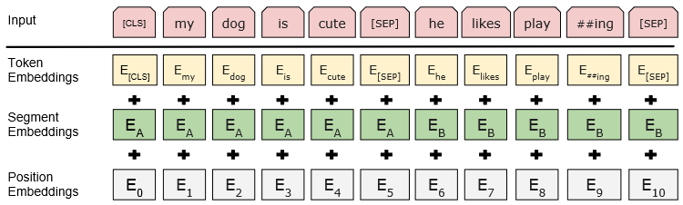

# BERT : Pre-training of Deep Bidirectional Transformers for Language Understanding阅读笔记

[原文](https://arxiv.org/abs/1810.04805 )

## Abstract

**BERT**：一个新的语言表示模型，Bidirectional Encoder Representations from Transformers，在未加标签的文本中做预训练，只需要加一个输出层就能被应用到其他任务中。

与前人工作关系：

- [ELMo](https://arxiv.org/pdf/1802.05365)：考虑了双向的信息，但ELMo使用RNN，应用到下游任务时候需要对架构做调整，BERT使用transformer，因此不需要做调整
- GPT：GPT只考虑单向的，用左边上下文信息预测未来，BERT联合了左右的上下文信息，是双向的

## Introduction

预训练语言模型能提升自然语言处理任务的效果（例如词嵌入，GPT等）

有两类利用预训练语言模型的策略：

1. 基于特征（feature-based）：例如ELMo，对每一个下游的任务，将预训练的表示作为额外的特征和输入一起作为模型的输入
2. 基于微调（fine-tuning）：例如GPT，将预训练的模型训练好后，不需要改变太多，只需要做微调

现有的预训练模型的局限性是：使用标准的语言模型，是单向的

​	BERT采用**基于掩码的语言模型（masked language model，MLM）**【MLM随机遮挡输入的某些token，目标是基于上下文预测该位置的原始token】，这样便结合了**双向的信息**；此外，BERT还做了“**预测下一个句子**”的任务，能让模型学习**句子层面**的信息；

- 这篇文章强调了双向预训练语言表示模型的重要性；
- BERT是一个基于微调的模型，对于很多sentence-level和token-level的特定任务均适用，在特定任务中，不需要做很繁重的模型调整和训练，且能表现地很好。

## Related work

### 非监督的、基于特征的工作

### 非监督的、基于微调的工作

### 在有标注的数据上做迁移学习

##  BERT

BERT含有两个步骤：

1. 预训练（pre-training）：模型在无标签的数据上训练
2. 微调（fine-tuning）：权重初始化为预训练阶段得到的权重，下游任务的训练过程中，采用带标签的数据，所有的参数均参与微调

**每一个下游的任务都会创建一个新的BERT模型，虽然它们都用预训练好的BERT模型做初始化**，如下图所示：

**模型架构**：BERT是一个多层的、双向的Transformer编码器架构，其中：
$$
L:Transformer块的个数	\\
H:隐藏层的大小（宽度）	\\
A:自注意力头的个数	\\
$$
有两个模型：

- $BERT_{BASE}(L=12,H=768,A=12)$ ，总参数110M，与GPT参数规模相当
- $BERT_{LARGE}(L=24,H=1024,A=16)$ ，总参数340M

**Input/Output 表示**

​	BERT的输入可以是句子，也可以是句子对（例如<Question, Answer>），因此，输入是一个“sequence”，可以是一个句子，也可以是两个句子拼接成的序列。

​	使用**WordPiece embeddings**（切词，若按空格做切词，一个词作为一个token，词典会很大，因此，若某个词的出现频率很小时，把它切开，若某个子序列【可能是一个词根】出现概率大，那么只保留子序列即可）。

​	构成序列的方法如下：

1. 每个序列的第一个token是[CLS]（classification），将该符号对应的输出向量作为整篇文本的语义表示，用于文本分类
2. 序列中，区分两个句子，使用两种方法：
   1. 用[SEP]区分它们
   2. 给每一个token原始向量加一个学习得来的嵌入，用于表示每个token属于第一个句子还是第二个句子
3. BERT嵌入层如下图所示（这些嵌入都是学习得来的）：

### Pre-training BERT

预训练阶段完成两个非监督的任务，如下：

#### Task1：Masked LM，带掩码的语言模型

​	随机隐藏一些输入token，预测这些被隐藏的token（这些被掩盖的token对应的隐藏层输出向量被做softmax），论文中，随机隐藏15%的token

​	存在的问题是：由于fine-tuning不需要[MASK]，因此pre-training和fine-tuning阶段之间不太匹配，因此，并不总是将被隐藏的词替换为[MASK]，而是：

- 随机选取15%的token用作预测
  - 以80%的概率替换为[MASK]
  - 以10%的概率替换为随机token（加入噪音）
  - 以10%的概率不变（使模型表示向实际观察到的词靠拢）

- 被选中的词 $i$ 的隐藏层向量输出 $T_i$ 将使用交叉熵损失预测原始的原始token

#### Task2：Next Sentence Prediction（NSP）

*由于许多下游任务（例如问答）是基于对两个句子之间关系的理解，因此，引入了这一任务*

​	训练时，输入句子A和句子B拼接成的序列，其中，50%的情况是B是A在文本中的下一个句子（`IsNext`），50%情况是B不是A在文本中的下一个句子（`NotNext`）。如上图BERT架构所示，C用于next sentence prediction（NSP）。

### Fine-tuning BERT

​	**BERT与其他基于encoder-decoder的区别**：由于把句子对作为输入，因此，self-attention能同时看到两个句子，一般的encoder看不到decoder的东西。

​	对于每一个下游任务，只需将特定的输入和输出与BERT模型对应，并且微调所有的参数。例如，根据下游任务的不同：

- **Input**：
  - paraphrasing 中的句子对 
  - entailment 中的假设-前提对
  - question answering中使用的question-passage 对
  - 文本分类或序列标记中使用的 $text-\emptyset$ 对
- **Output**：
  - token的BERT输出表示被输入到输出层用于token水平的任务
  - [CLS]表示被输入到输出层用于分类

## Experiment

### GLUE

**General Language Understanding Evaluation (GLUE) benchmark**

训练一个用于分类的输出层 $W$ ，与[CLS]的最后输出C乘积做softmax，构造出一个多分类模型：
$$
softmax(CW^T)
$$

### SQuAD v1.0

**Stanford Quesion Answering Dataset**

​	给定一段文本，提出一个问题，把答案从文本中找出。任务建模为：对文本序列，判断每一个token是否是答案的开头S，是否是答案的结尾E。

具体来说，学两个向量 $S \in R^H$ ， $E \in R^H$ ，分别对应词元是答案开始的概率和答案结尾的概率。

第 $i$ 个token为答案序列的起始token的概率为：
$$
P_i=\frac{e^{ST_i}}{\sum_j{e^{ST_j}}}
$$
同理，第 $j$ 个token为答案序列的末尾token的概率为：
$$
P_j=\frac{e^{ET_j}}{\sum_i{e^{ET_i}}}
$$
span $(i,j)$ 作为答案序列的分数定义为： $ST_i+ET_j$ 

## Conclusion

​	非监督的预训练已经成为NLP模型的重要部分，数据集较小时，采用该方法，也能使模型达到很好的效果。本文的主要贡献是采用了**深度双向结构**，能够让相同的预训练模型被运用于广泛的NLP任务中。
