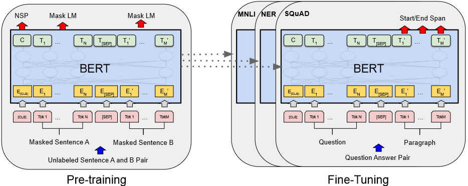

# BERT : Pre-training of Deep Bidirectional Transformers for Language Understanding阅读笔记

[原文](https://arxiv.org/abs/1810.04805 )

## Abstract

**BERT**：一个新的语言表示模型，Bidirectional Encoder Representations from Transformers，在未加标签的文本中做预训练，只需要加一个输出层就能被应用到其他任务中。

与前人工作关系：

- [ELMo](https://arxiv.org/pdf/1802.05365)：考虑了双向的信息，但ELMo使用RNN，应用到下游任务时候需要对架构做调整，BERT使用transformer，因此不需要做调整
- GPT：GPT只考虑单向的，用左边上下文信息预测未来，BERT联合了左右的上下文信息，是双向的

## Introduction

预训练语言模型能提升自然语言处理任务的效果（例如词嵌入，GPT等）

有两类利用预训练语言模型的策略：

1. 基于特征（feature-based）：例如ELMo，对每一个下游的任务，将预训练的表示作为额外的特征和输入一起作为模型的输入
2. 基于微调（fine-tuning）：例如GPT，将预训练的模型训练好后，不需要改变太多，只需要做微调

现有的预训练模型的局限性是：使用标准的语言模型，是单向的

​	BERT采用**基于掩码的语言模型（masked language model，MLM）**【MLM随机遮挡输入的某些token，目标是基于上下文预测该位置的原始token】，这样便结合了**双向的信息**；此外，BERT还做了**“预测下一个句子”**的任务，能让模型学习**句子层面**的信息；

- 这篇文章强调了双向预训练语言表示模型的重要性；
- BERT是一个基于微调的模型，对于很多sentence-level和token-level的特定任务均适用，在特定任务中，不需要做很繁重的模型调整和训练，且能表现地很好。

## Related work

### 非监督的、基于特征的工作

### 非监督的、基于微调的工作

### 在有标注的数据上做迁移学习

##  BERT

BERT含有两个步骤：

1. 预训练（pre-training）：模型在无标签的数据上训练
2. 微调（fine-tuning）：权重初始化为预训练阶段得到的权重，下游任务的训练过程中，采用带标签的数据，所有的参数均参与微调

**每一个下游的任务都会创建一个新的BERT模型，虽然它们都用预训练好的BERT模型做初始化**，如下图所示：

## Conclusion

​	非监督的预训练已经成为NLP模型的重要部分，数据集较小时，采用该方法，也能使模型达到很好的效果。本文的主要贡献是采用了**深度双向结构**，能够让相同的预训练模型被运用于广泛的NLP任务中。
